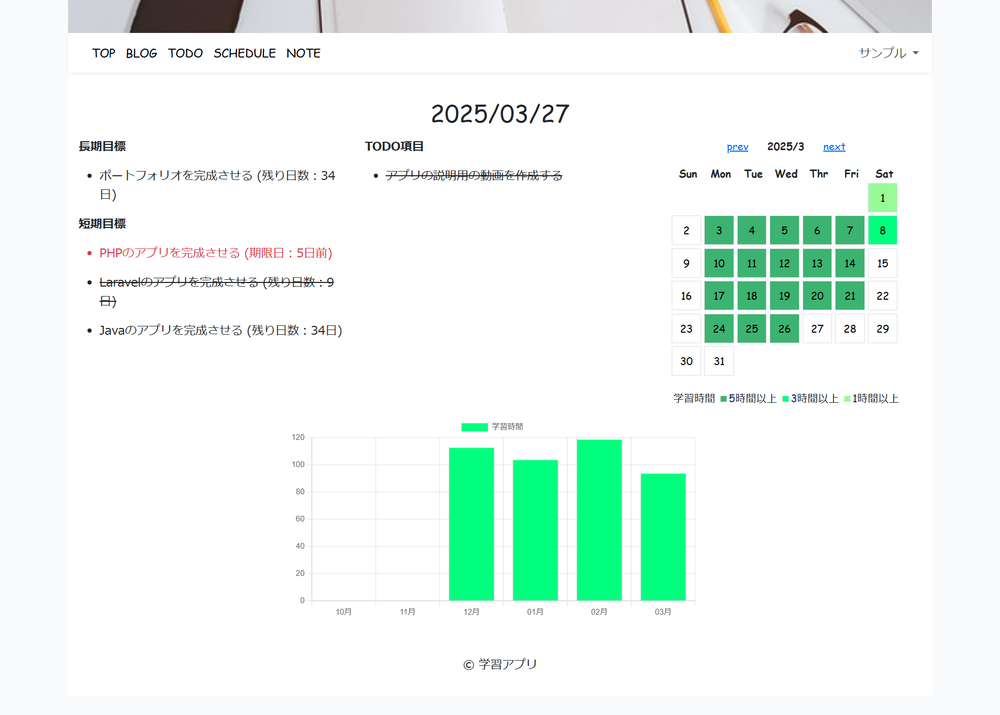
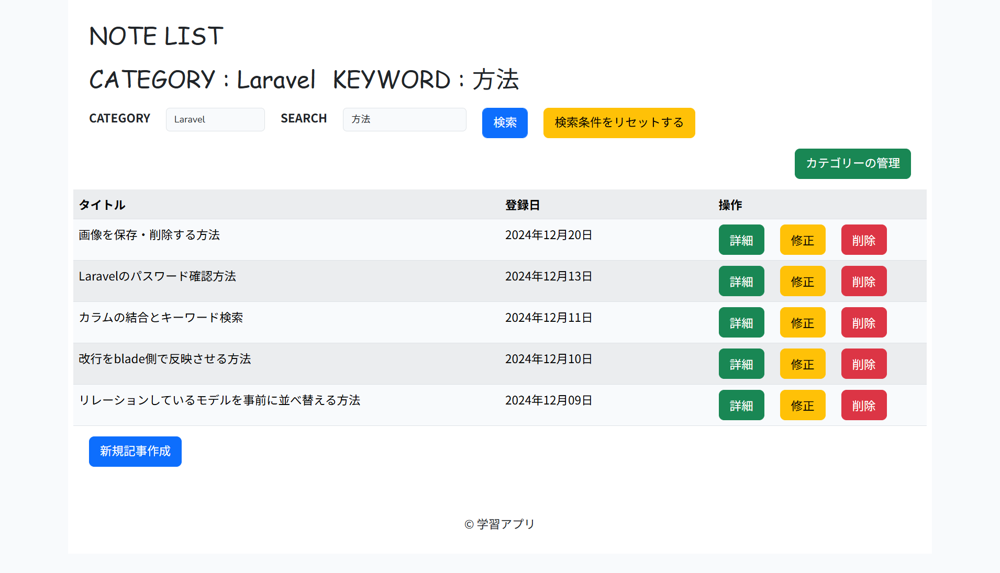
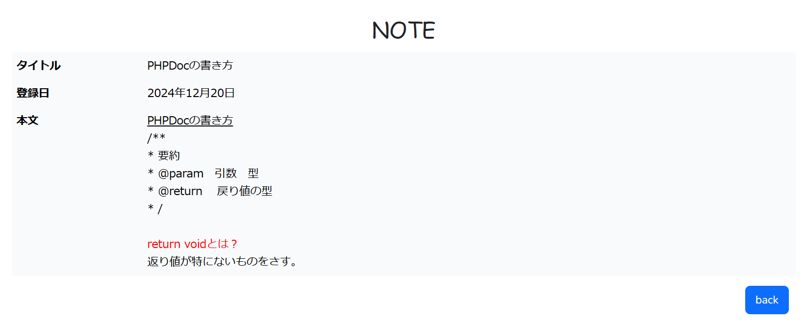

# 学習アプリ

学習の目標を設定し、日々の記録、ノートの作成を行うアプリケーション。

トップ画面。長期/短期目標、TODO項目、学習日を反映したカレンダー・グラフが表示される。

ブログ一覧画面。

ブログの編集画面。特定の記号で文字列を囲うと、詳細表示画面で文字列が赤字/太字/下線付きで表示される。
同一の日付のブログを登録しようとした場合は、フラッシュメッセージが表示される。

TODO項目一覧画面。期限日が過ぎたものは赤字、完了日が登録されたものは線が引かれる。

長期/短期目標一覧画面。長期目標に対して複数の短期目標が設定できる。

ノート一覧画面。カテゴリー/キーワードでの検索が可能。キーワードは複数検索可能。

ノート詳細画面。ブログと同じで、作成時に特定の記号で囲った文字列は、赤字/太字/下線付きで表示される。

カテゴリー管理画面。ノートに設定するカテゴリーを作成・修正・削除することができる。

ユーザー情報編集画面。初期値として登録済の情報が設定される。

## 概要

  - 学習の目標と期限日を立てて、計画的に学習を行う。
  - TODO項目を設定し、学習すべき内容を明確化する。
  - 学習した内容、時間を記録することで、進捗状況を整理する。
  - ノートを作成することで、学習した内容をいつでも確認できる。

## 開発した背景

プログラミングを学習を始めた当初、学生時代に培った紙媒体での勉強方法で学んでいました。
しかし、紙媒体では書き写す手間に反して記録できる情報量が少なく、学習の効率化が必要だと考えるようになり、作成に至りました。

## 使用技術

  - PHP 8.0.15
  - Laravel 10.38.0
  - MySQL 10.4.22
  - JavaScript 
  - jQuery 3.7.1
  - Chart.js

## 機能一覧

  - ユーザー登録、ログイン機能
    - ユーザー情報編集機能
  - ブログ作成機能
    - ブログ一覧表示機能
    - ブログの登録・修正・削除機能
  - 目標設定機能
    - 長期/短期目標一覧表示機能
    - 長期/短期目標設定・修正・削除機能
  - TODO項目作成機能
    - TODO項目一覧表示機能
    - TODO項目作成・修正・削除機能
  - ノート作成・表示機能
    - ノート一覧表示機能
    - ノートの作成・修正・削除機能
    - ノート検索機能
  - カテゴリー設定機能
    - カテゴリー作成・修正・削除機能

## 苦労した点

  - 学習した時間に応じてカレンダーの該当日の色を変化させる設定
  - ノートやブログに特定の記号を入力すると範囲内の文字に色の赤字、太字、下線付きに変化させる条件文の設定
  - ノート一覧画面からキーワード検索する場合のソースコードの作成
